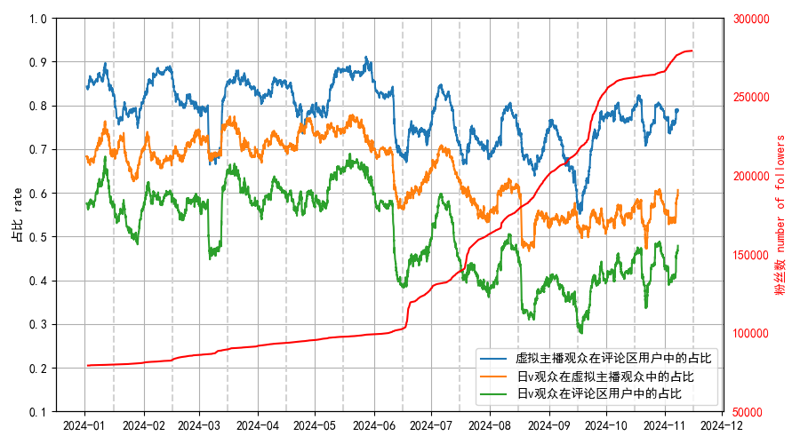

# 真红莉爱今年评论区的用户成分变化情况
用户的分类方法：从不同虚拟主播的动态（包括投稿）评论区收集用户，虚拟主播名单来自vtbs，收集了 374683 个用户。如果一个用户有某个虚拟主播的粉丝团灯牌或者评论过3条以上，则用户视为这个虚拟主播的“有效粉丝”。至少是1个虚拟主播的“有效粉丝”的人视为“虚拟主播观众”，至少是3个日本虚拟主播的“有效粉丝”的人视为“日v观众”。

这里按最近收集的数据给用户分类，相当于假设一个用户的类型是不会变化的，这是不符合现实的。但是没办法收集到用户不同时间的状态。如果假设大部分用户在很短时间里就确定了类型，可以认为影响不大。

收集今年以来在真红莉爱的评论区出现的所有评论，共收集到 37104 条评论，11816 个用户。统计了不同时间段里发送评论的用户中不同类型的比例，并绘制曲线。曲线中的不同点对应不同时间段内的统计结果，对应的时间段是这个点所在位置之后的7天之内，例如x轴位置是1月1日的点表示的是1月1日到1月7日这个时间内的统计结果。

**真红莉爱评论区用户成分变化情况**

图中的红色曲线是粉丝数。左侧的刻度是不同类型的占比的刻度，右侧的刻度是粉丝数的刻度。
莉爱的评论区里虚拟主播观众的用户比例最近半年一直减少，虚拟主播观众中日v观众的比例也在减少。这可能说明，吸引了很多不看虚拟主播的人和国v的观众来看。但是因为用户的类型会变化，用户可能发送评论之后过一段时间才变成了虚拟主播观众或者日v观众，这也可能是更早期的评论区里虚拟主播观众和日v观众更多的一个原因。

## 一些发送评论很多的用户
|名称|评论数|名称|评论数|
|---|---|---|---|
|1.UID:1585**3	|1324|2.UID:1585***3	|401|
|3.UID:8335**7	|341|4.UID:1211*1	|304|
|5.UID:7930**2	|299|6.UID:5597***3	|263|
|7.UID:1778*****0	|243|8.UID:1842**1	|242|
|9.UID:6229****9	|229|10.UID:5551***6	|229|
|11.UID:3524****5	|203|12.UID:1585****4	|172|
|13.UID:1875*****9	|148|14.UID:8561**8	|148|
|15.UID:6448**5	|143|16.UID:1729**5	|140|
|17.UID:4525***4	|131|18.UID:4452****8	|126|
|19.UID:3625***4	|115|20.UID:9459***9	|103|
|21.UID:4352****8	|103|22.UID:1142*****4	|99|
|23.UID:1982*****3	|98|24.UID:3546***********5	|97|
|25.UID:4911***8	|94|26.UID:2511*1	|94|
|27.UID:3845****7	|92|28.UID:6898****0	|90|
|29.UID:1783****5	|83|30.UID:3245***2	|82|
|31.UID:8063***9	|80|32.UID:2920***7	|78|
|33.UID:2382****4	|78|34.UID:4906****5	|75|
|35.UID:8957**1	|75|36.UID:1209*6	|73|
|37.UID:5170***3	|73|38.UID:4255****9	|72|
|39.UID:1932**2	|71|40.UID:1217***2	|70|
|41.UID:8765***1	|70|42.UID:4747****5	|70|
|43.UID:8642***7	|70|44.UID:1748****9	|68|
|45.UID:3650**7	|68|46.UID:1334**4	|68|
|47.UID:3267**2	|67|48.UID:3546***********6	|66|
|49.UID:3918****9	|64|50.UID:1219****5	|63|

