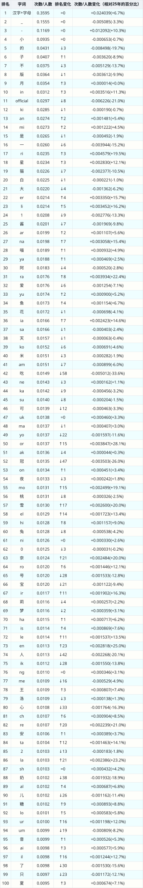
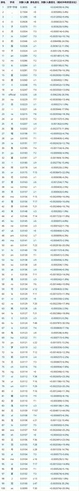
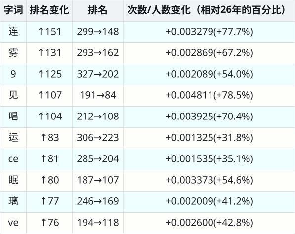
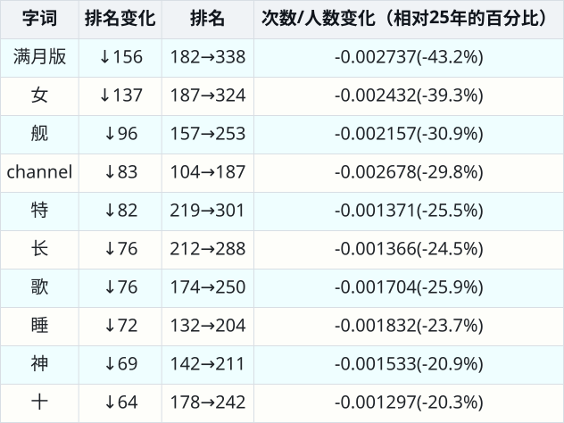

# 主题
统计虚拟主播的起名用字经过一年时间发生了什么变化

# 方法
收集了 “2025-01-01到2025-01-10” 和 “2026-01-01到2026-01-10” 两个时间段直播过的虚拟主播，分别统计虚拟主播名字中不同字出现的次数。

2025年收集到19897人，2026年收集到19466人。从哔哩哔哩直播页（live.bilibili.com）的虚拟主播分区收集主播，不能保证一定收集到全部人。

英文字母以2个字母为单位进行统计，如abcd视为ab、bc、cd各出现1次。同一个字在一个名字中多次出现只记为1次。official、channel、ovo、满月（包括满月或双满，包括后接的“版”或“回”字）视为整体。
名字中含有bili_的整个忽略。
一个uid在一个时间段中可能会有多个名字，以最后一个为准。

两个时间段收集到的总人数不同，不同时间段的名字出现次数不适合直接比较，因此计算“字出现次数/总人数”来进行比较。

# 结果

表格中的排名变化指同一个字词的2026年排名相对2025年排名的变化，两个表格都一样。而两个表格中“人数/次数变化”的百分比的计算方法则不同，一个是以25年为分母，一个是以26为分母。

计算排名时，出现次数相同的字词并列为同一个排名。（不过对目前展示的结果没有影响）

上升、下降结果中只考虑出现次数超过100次的字词，以免过度突出小幅度随机变化。

## 2025年最常见的100个字（词） 
见[csv表格](2025（总人数19897）.csv) 

## 2026年最常见的100个字（词） 
见[csv表格](2026（总人数19466）.csv)

## 2026相对2025年排名上升数最多的10个字（词） 
见[csv表格](上升榜.csv) 

## 2026相对2025年排名下降数最多的10个字（词） 
见[csv表格](下降榜.csv)

#个人评论

在名字里使用冠名、满月的做法看起来正在过时，official、channel也在过时。一个明显的新的流行做法是名字里加“唱见连”