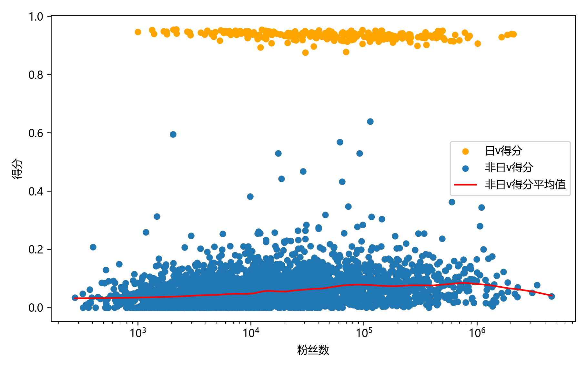

# 哪些中国v受日v观众喜欢？基于共同观众的判断方法

中v和日v不是指国籍，而是依次考虑语言、社交关系（如联动对象和所属公司）和国籍的结果，观众能直接感受到东西更重要。不好判断的人视为中v，正好看看是什么水平。vup名单来自vtbs，日v是手动分类，选出了297个。

几个例子：孙有劲Sunyeojin，直播用日语，社交对象基本是日v，视为日v。安堂いなり，多语言，VR Link成员，视为中v。茉吱Mojuko，一二代共用号，视为中v。燐・珈尔特，vtbs名单里没有收录，如果有下次那我会分类成中v。日v字幕组视为日v。个别公司老板也列出看看结果。

做法是从每个vup的评论区收集观众，出现过2次以上或有灯牌的是有效观众。收集的时间范围是2024年上半年（大致时间范围，不是严格的上半年）。然后给每个观众打分，看日v越多的分数越高，满分1分。最后计算每个vup的观众分数的平均值作为vup的分数，分越高说明和日v共同观众越多。
分数的计算方法是

 $$s = 1 - \frac{1}{1+p/p_0}$$
 
其中 $s$ 是分数， $p$ 是观众关注的虚拟主播中日v的比例， $p_0$ 是所有虚拟主播中日v的比例。
  
有效观众小于20的不会列出。出现2次为有效、观众小于20都是我随意取的我认为不过分的数字。其他数字也试过，不会造成太大的影响。

**总体分数分布情况**

**中v之中前200名的名称、得分和统计观众数**
|名称|分数|观众数|名称|分数|观众数|
|---|---|---|---|---|---|
|1. 凤玲天天Official      |0.639|305|2. 波間無居_Mui          |0.594|70|
|3. 星河Sagi            |0.568|1171|4. 雷米尔Remiel         |0.529|99|
|5. Riru璃露            |0.442|146|6. 雪璐_Sheryl         |0.381|77|
|7. 茉吱Mojuko          |0.363|508|8. 阿德涅adeni          |0.318|21|
|9. 爱丽诺_MoMo          |0.313|22|10. Laine_official    |0.304|295|
|11. 花洛栗栗子             |0.284|141|12. 秋蒂Q               |0.284|350|
|13. 早稻叽               |0.279|521|14. 朝仓鱼块AsakuraYukai  |0.270|302|
|15. taku道             |0.264|79|16. 花樽栗守              |0.264|177|
|17. Kasa今天秃头没         |0.260|451|18. 月乃盈-つきのみちる-       |0.257|23|
|19. 茉澪Magonia         |0.255|54|20. 米香Rice_Official   |0.254|248|
|21. 小柔Channel         |0.254|1059|22. 梨蒴KiTsu_Official  |0.253|44|
|23. 神姬伊娜狸Inari        |0.246|29|24. 希亚娜Ciyana         |0.245|706|
|25. 钉宫妮妮Ninico        |0.236|539|26. 片桐秋_Official      |0.236|84|
|27. 赛拉Sera            |0.232|30|28. 奶糖さの_sano         |0.232|52|
|29. 矢神水心Channel       |0.230|30|30. 星空凛脂              |0.229|32|
|31. 安堂いなり_official    |0.228|480|32. 桜餅奈奈薰Ch           |0.227|176|
|33. Vika蔚卡            |0.225|155|34. 空空_KonKon         |0.220|149|
|35. 瑠璃川こはくOfficial    |0.217|50|36. 诺娅Sukie           |0.211|23|
|37. 新新社恐人             |0.211|114|38. Rata芮塔            |0.210|21|
|39. 苏梦瑶-official      |0.210|28|40. 巫贼_ikataruto      |0.209|348|
|41. 山椒阿露波Arpa         |0.209|577|42. 维涅塔Vinetta        |0.209|29|
|43. 白银莉莉Official      |0.207|301|44. 白银莉莉Nyaa          |0.207|142|
|45. 宇佐紀ノノ_usagi       |0.207|410|46. 软绵绵official       |0.207|43|
|47. 紗耶_sayako         |0.204|483|48. 桃井最中Monaka        |0.204|529|
|49. 路伊丝Louise         |0.203|446|50. 喵田弥夜Miya          |0.203|432|
|51. 炸炸毛鲨_罗修channel    |0.202|23|52. 白鹭镜_银silveroid    |0.202|83|
|53. 哎咿多工作室            |0.200|38|54. 生命幻象              |0.200|183|
|55. 氵六青               |0.199|98|56. 沙月ちゃん             |0.199|415|
|57. 香甜小兔子             |0.199|60|58. 空酱Official        |0.198|28|
|59. 克拉拉KiraraV        |0.198|277|60. 胡桃Usa             |0.197|476|
|61. 安心愛               |0.197|388|62. 星羽幸Official       |0.196|262|
|63. Yuka碳             |0.194|53|64. ゚喵奈               |0.192|415|
|65. 朝雾萤Official       |0.191|25|66. 莉莉安_Official      |0.185|90|
|67. 爱梨Rico-8-         |0.185|21|68. AO凹               |0.185|26|
|69. 呆呆不吃喵             |0.184|511|70. 卡诺娅Kanoa          |0.183|377|
|71. 浅川玉乃              |0.183|375|72. 小毛拔了个火罐           |0.183|83|
|73. 不知名小黑猫            |0.183|42|74. 明夏珊海              |0.182|308|
|75. 酒酒井Anri           |0.181|567|76. 芒崎小吉Channel       |0.180|98|
|77. 芙喵-ネコフラン          |0.180|39|78. w丘丘w              |0.180|102|
|79. 天国的莉莉             |0.179|31|80. 勺Shaun            |0.177|564|
|81. fa漠               |0.176|40|82. 辣奶火锅的日常           |0.175|21|
|83. 谢儿Ciel            |0.174|182|84. 梦咲有绪              |0.174|311|
|85. 凪紗nagisa          |0.173|86|86. 罗菈Rola            |0.173|630|
|87. 塔洛斯Tartarus       |0.173|30|88. Pomu的妖精王国         |0.173|46|
|89. 小日和酱Hiyori        |0.172|49|90. 七濑Unia            |0.172|359|
|91. 裔书Izu             |0.172|35|92. 灰音Haine           |0.172|174|
|93. 美少女晴晴晴子           |0.171|590|94. Snozaki筱崎         |0.171|51|
|95. 糖心可可娅             |0.169|28|96. 灯瑠hiru            |0.169|86|
|97. 千枝芽May            |0.168|33|98. AIChannel中国绊爱     |0.168|378|
|99. 天气阿准official      |0.168|203|100. 铃音_Official       |0.167|562|
|101. 神咲乃希NOKi          |0.167|147|102. 米哦Official        |0.166|316|
|103. 尼奈nine_Official   |0.165|358|104. 白神遥Haruka         |0.164|617|
|105. 樱饼饼Sakura         |0.163|152|106. 回收娘Official       |0.163|66|
|107. 奈落米拉米             |0.162|1115|108. 括号笑叔              |0.162|711|
|109. 卡氧吃不饱             |0.162|48|110. 花臼usu             |0.162|184|
|111. 綾奈奈奈              |0.162|655|112. 雨宫水希Channel       |0.161|227|
|113. 满月Channel         |0.161|76|114. 桃泽英梨梨channel      |0.161|45|
|115. 米浆浆浆              |0.161|34|116. 暮月Medus           |0.160|717|
|117. 東雪蓮Official       |0.160|388|118. 楠いのり              |0.159|38|
|119. 空伶cherry          |0.159|21|120. 衣笠雪绘              |0.159|67|
|121. 望月希咏              |0.159|98|122. 小可学妹              |0.157|1123|
|123. 红晓音Akane          |0.157|1155|124. 星宫颜Ekira          |0.156|127|
|125. vivian198808      |0.156|63|126. 盐月Yuu             |0.156|137|
|127. 谢林的侦探事务所          |0.155|41|128. 白露_Hakuro         |0.154|570|
|129. 林莉奈RinaHayashi    |0.154|566|130. 鱼鸽鸽               |0.154|36|
|131. 四月一日夢             |0.154|22|132. 米露提亚Official      |0.154|41|
|133. 向阳Hihi            |0.154|435|134. 萝月_Official       |0.154|33|
|135. 宫园凛RinMiyazono    |0.153|194|136. 艾因Eine            |0.153|460|
|137. 贝塔Tenjo1          |0.152|96|138. 入星祈望              |0.152|29|
|139. 星星奈_HoshiNa       |0.152|30|140. 朽木素               |0.151|26|
|141. 花满Official        |0.151|421|142. 虚研社长Official      |0.150|389|
|143. 小野寺杏砂Channel      |0.150|38|144. 卡农_Channel        |0.150|260|
|145. tanoki是打工狸        |0.150|102|146. 芙菈吧噗Channel       |0.149|72|
|147. 难道越越不可爱           |0.149|93|148. 刺猬SWCW            |0.149|29|
|149. 亚可Ako             |0.149|96|150. 弦羽Hane            |0.149|118|
|151. 软桃桃_Official      |0.149|63|152. 阿斯三世Astaroth      |0.148|40|
|153. 莉姬LIJI            |0.148|103|154. 神月萤Hotaru         |0.148|54|
|155. 丝塔莉               |0.148|145|156. 泰蕾莎Channel        |0.148|384|
|157. 乐艾_Nine           |0.148|27|158. 达妮娅dani           |0.147|93|
|159. 人形冬萌_Tomo         |0.147|83|160. 星空恋liann          |0.147|27|
|161. 秋葵ovo             |0.147|29|162. 千鹤凪_Nagi          |0.146|47|
|163. 月食mooneat         |0.146|47|164. 希维Sybil           |0.146|164|
|165. 蛍川                |0.146|136|166. 桜都子               |0.146|69|
|167. 游雪姬アルファ_Official  |0.145|33|168. 蜜汁C今天摸了           |0.145|77|
|169. 电疯扇最爱吃大米          |0.145|100|170. 小羽HaneDa          |0.145|84|
|171. 真穗Maho_Official   |0.144|233|172. 广末小季              |0.144|30|
|173. 阿里鸭Alya           |0.144|383|174. Ruriko琉璃子Channel  |0.144|336|
|175. kuu_玖             |0.143|43|176. keii萤             |0.143|214|
|177. 怜音Ren             |0.143|332|178. 穆小泠Official       |0.143|370|
|179. 秋田唯_Yui           |0.143|30|180. 莱妮娅_Rynia         |0.142|772|
|181. Hooxi_Official    |0.142|1018|182. 花涟清衣              |0.142|58|
|183. Yenn咕噜咕噜          |0.142|33|184. 梦音茶糯              |0.142|623|
|185. 莉夏Lecia           |0.142|135|186. 勾檀Mayumi          |0.142|903|
|187. 魔卡猫咪              |0.142|32|188. 兮子cc              |0.142|623|
|189. 早凉                |0.142|860|190. 星川铃Rin            |0.142|74|
|191. 昼歌里Hiru_u         |0.141|429|192. 绯奈Hina            |0.141|81|
|193. 猫均Yuka            |0.141|297|194. Rinnya_0w0        |0.141|128|
|195. 艾露露Ailurus        |0.141|896|196. 悠米_Yuumi          |0.141|608|
|197. 申䒕雅_小雅Official    |0.141|156|198. 石榴ZaKuRo_Channel  |0.141|40|
|199. 白乃菟Nettie         |0.140|32|200. 黎歌Neeko           |0.140|610|

**所有v中的前400名**
|名称|分数|观众数|名称|分数|观众数|
|---|---|---|---|---|---|
|1. Ako_official      |0.955|21|2. 樱月花音_official     |0.954|28|
|3. 饴姬兔莓_Official     |0.954|35|4. 百濑杏那official      |0.953|41|
|5. 莎乐美的满分管家          |0.953|54|6. 劳伦伊罗斯的通缉名单        |0.952|69|
|7. 月森梦爱              |0.951|91|8. ChroNoiR_搬运组      |0.951|47|
|9. Caramel_奶糖        |0.951|67|10. 绿仙Official        |0.951|91|
|11. 伏见ガク搬运组           |0.951|156|12. 駄天使inori          |0.950|135|
|13. 剑持刀也搬运组           |0.950|374|14. 葛叶Official        |0.950|584|
|15. 不破湊的甜甜圈工坊         |0.950|68|16. 夜樱诺娅_Official     |0.950|39|
|17. 犬塚いちごOfficial     |0.950|28|18. 明堂白音Official      |0.950|37|
|19. 鬼霧シアン_Official    |0.950|49|20. 叶Official         |0.950|785|
|21. 子猫球official       |0.949|114|22. 星熊uru             |0.949|584|
|23. 古乃叶羽留Channel      |0.948|49|24. 猫雨夹雪_official     |0.948|79|
|25. 丑城めうか_Official    |0.948|23|26. 游乐木时_Official     |0.948|41|
|27. 妻末_official       |0.948|149|28. 狸猫花生搬运组           |0.948|71|
|29. 樱叶卡农_Official     |0.947|45|30. 鹫见咪咪-Mimi-        |0.947|90|
|31. 微微微美玖萝Official    |0.947|80|32. Kanna_康娜Official  |0.946|25|
|33. -official-Spi酱    |0.946|21|34. 転生子餅              |0.946|124|
|35. 梦追翔Official       |0.946|37|36. 君野莉露露_Official    |0.945|23|
|37. 花谱_kaf            |0.945|367|38. 三枝明那搬运组           |0.945|40|
|39. 猫羽丘比              |0.945|202|40. 天使猫Parfaitty      |0.945|134|
|41. 湊-阿库娅Official     |0.944|932|42. 雪豹Leo_official    |0.944|194|
|43. 加贺美隼人Official     |0.944|26|44. 三日月千留Channel      |0.944|37|
|45. 向日葵なっつofficial    |0.944|401|46. 甲斐田晴的魔物研究所        |0.944|40|
|47. 甘井羽衣_Official     |0.943|365|48. 疾风Haya_Official   |0.943|125|
|49. 角卷绵芽Official      |0.943|44|50. 咲花なる              |0.943|456|
|51. 火羽ひのめ             |0.943|54|52. 無田虚_official      |0.943|26|
|53. ななひら放送会           |0.943|34|54. 天音彼方Official      |0.943|176|
|55. 森瀬Tsugumi         |0.943|289|56. 柚夢_YUYU_official  |0.942|97|
|57. Omesis搬运组         |0.942|62|58. 魔界之莉莉姆搬运组         |0.942|25|
|59. 樱巫女Official       |0.942|250|60. 安洁Official        |0.942|153|
|61. 木乃伊子_official     |0.942|510|62. 普梨魔芽璃流Official    |0.942|39|
|63. 白雪巴_Official      |0.942|44|64. 乙夜かろり_karory      |0.942|61|
|65. CIEL_VanillaSky   |0.941|34|66. 异世界情绪             |0.941|471|
|67. 幸祜-koko-          |0.941|64|68. 焰灵莓炉Channel       |0.941|94|
|69. 璞菈丝_official      |0.941|22|70. Niar-2A           |0.941|731|
|71. 猫猫Official        |0.941|70|72. 宫川雪乃_official     |0.941|52|
|73. 鈴宮鈴               |0.940|1284|74. 铃鹿诗子Official      |0.940|101|
|75. 紫桃爱音Official      |0.940|433|76. 存流・明透・Albemuth    |0.940|215|
|77. 瀬兎一也_Official     |0.940|154|78. 心羽萝妮Official      |0.940|362|
|79. 水无濑波流Channel      |0.940|169|80. 电气羊_珂莉黛露          |0.940|92|
|81. 理芽_RIM            |0.940|259|82. 翡翠リーヴルofficial    |0.939|31|
|83. 猫音铃official       |0.939|260|84. 鹿乃ちゃん             |0.939|1050|
|85. Milky_Vtuber      |0.939|154|86. 文月卯月Official      |0.939|26|
|87. 古守血遊official      |0.938|1001|88. 神楽七奈Official      |0.938|541|
|89. 放送部Official       |0.938|34|90. 金城院花恋Official     |0.938|208|
|91. 茶乃間未来_Mirai       |0.938|557|92. 魔狼咪莉娅             |0.938|1157|
|93. 夏色祭Official       |0.938|671|94. 猫羽小真理_Official    |0.938|130|
|95. 神代るるるOfficial     |0.938|42|96. 餅村尾丸omaru         |0.938|40|
|97. KMNHZ-China       |0.938|123|98. 竜輝音緒流_Official    |0.937|100|
|99. 真咲樱_Official      |0.937|306|100. 早濑弥生Official      |0.937|476|
|101. 莉泽的烤肉御膳房          |0.937|27|102. 夢乃栞Yumeno_Shiori  |0.937|1179|
|103. 高贝兹咪咪子Official    |0.937|175|104. 尼禄穿梭之火_official   |0.936|189|
|105. 绯织乌露_Official     |0.936|153|106. 星ノ宮春鈴_Official    |0.936|215|
|107. 森野莓洛Official      |0.936|336|108. まこと-macoto官方      |0.936|376|
|109. 艾玛莉莉丝-channel     |0.936|44|110. AIChannel官方       |0.936|517|
|111. 悠音Yune            |0.936|144|112. 思绪_official       |0.936|49|
|113. 东堂比乃Official      |0.936|462|114. NEQRE-ねこれ         |0.936|80|
|115. 玛琳璱Official       |0.936|110|116. 白上吹雪Official      |0.936|333|
|117. 小东人魚Official      |0.936|654|118. 猫芒ベル_Official     |0.936|1299|
|119. 餡蜜椿official       |0.936|75|120. やーちゃん_Ya酱         |0.936|483|
|121. 椎名菜羽Official      |0.935|1354|122. 织田信姬official      |0.935|28|
|123. Monaka_Official   |0.935|23|124. 刻耳柏洛梅芙Meifu       |0.935|219|
|125. 夢河夢_Official      |0.935|547|126. 星街彗星Official      |0.935|686|
|127. PochiKorone       |0.934|366|128. 遊流_yuru           |0.934|90|
|129. 物述有栖Official      |0.934|652|130. 铃白小夜_Official     |0.934|1042|
|131. 铃音舞梦_official     |0.934|39|132. YuNi_Official     |0.934|116|
|133. 雨宮あいす_official    |0.934|53|134. 泡沫メモリ_Official    |0.934|36|
|135. 田中姬铃木雏Official    |0.934|1093|136. 猫又小粥Official      |0.934|71|
|137. 白银诺艾尔Official     |0.933|39|138. 真红莉爱official      |0.933|715|
|139. 乙女音Official       |0.933|796|140. 神楽Mea_Official    |0.933|803|
|141. 七彩手鞠Official      |0.933|56|142. 桃葉Momoha          |0.933|642|
|143. 天音マリー             |0.932|456|144. 森永みうofficial      |0.932|396|
|145. 黑桐亚里亚Official     |0.932|96|146. 樋口枫Official       |0.932|241|
|147. 多间硝子_Official     |0.932|37|148. 猫宫日向Official      |0.932|279|
|149. 富士葵中国粉丝团          |0.931|46|150. 羽澄照乌愈Official     |0.931|128|
|151. 孙有劲Sunyeojin      |0.931|270|152. 春猿火_harusaruhi    |0.931|117|
|153. 八鏡mira            |0.930|323|154. 嶌永爱娜Official      |0.930|68|
|155. love_charmulet    |0.930|326|156. AyamyあやみOfficial  |0.930|30|
|157. rurudo_るるどらいおん    |0.930|204|158. 晴步子清楚组            |0.930|21|
|159. 梱枝莉子Official      |0.930|148|160. 猫姬琥珀_official     |0.930|691|
|161. しらたまOfficial      |0.930|188|162. 癒月巧可Official      |0.930|62|
|163. 萝卜子Official       |0.930|48|164. 花丸晴琉Official      |0.930|1236|
|165. 戌神沁音Official      |0.929|81|166. 委员长杂鱼搬运           |0.929|373|
|167. 健屋花那_Official     |0.929|125|168. hololive          |0.929|315|
|169. 小鸟游杏子Official     |0.929|1028|170. 眞白花音_Official     |0.929|500|
|171. 天宫心的新新人搬运         |0.929|24|172. 杏仁Miru搬运          |0.928|73|
|173. GEMS_COMPANY官方    |0.928|112|174. 猫雷NyaRu_Official  |0.928|1305|
|175. 心斎橋オクトOfficial    |0.928|272|176. 莓野麻团Official      |0.928|626|
|177. 猫宫心爱              |0.928|720|178. 竹花诺特Official      |0.928|113|
|179. 賴城来拉_LairaRaijo   |0.928|296|180. 笹木咲Official       |0.928|36|
|181. 犬山玉姬Official      |0.927|350|182. 羽咲Rabi_Official   |0.927|741|
|183. 静凛Official        |0.927|79|184. 小豆沢あずきofficial    |0.927|496|
|185. HACHI蜂蜜酿造厂        |0.927|126|186. 唯茉瑠_Official      |0.926|28|
|187. 夏诺雅_shanoa        |0.926|1239|188. 雫るる_Official      |0.926|628|
|189. 怠惰V_official      |0.926|374|190. 星川莎拉_Official     |0.926|225|
|191. UzuMe舞紫梦          |0.925|100|192. 椎名唯华Official      |0.925|52|
|193. 九重紫Official       |0.925|886|194. 纸代棗-やすゆきOfficial  |0.925|36|
|195. 帕里_Paryi          |0.925|474|196. 可妮Koni_Official   |0.925|944|
|197. 戌亥床Official       |0.924|113|198. 樱咲奈央_Official     |0.924|495|
|199. 天占milo_Official   |0.924|201|200. NoWorld_Official  |0.924|549|
|201. 高槻律official       |0.923|546|202. 修女克蕾雅Official     |0.923|92|
|203. 天曰小雏Official      |0.923|813|204. 千草はな              |0.923|22|
|205. 物述有栖-爱丽丝搬运        |0.923|57|206. 咪萪猫_Mikeneko      |0.923|685|
|207. 飞鸟尤卡里Official     |0.923|142|208. 羊姫桃香奈_Official    |0.922|91|
|209. 棉花糖ame            |0.922|561|210. 保梦羽酱_pomuuchan    |0.921|132|
|211. 龙胆尊Official       |0.921|66|212. 铃木胜Official       |0.921|284|
|213. 宝钟玛琳Official      |0.921|55|214. 九尾狐_Official      |0.919|57|
|215. 星宮汐Official       |0.919|1037|216. 狮子神蕾欧娜_official   |0.918|31|
|217. Azulim搬运组         |0.918|110|218. 時雨羽衣Official      |0.918|142|
|219. 金切遊楽Channel       |0.917|715|220. 饼叽Official        |0.917|25|
|221. 藤兔Fullmoon        |0.917|172|222. 狮子姬萝蜜欧Official    |0.916|46|
|223. 恋乃夜舞_propro       |0.916|180|224. 牛野露哞_usrm         |0.915|1013|
|225. 花园Serena          |0.914|545|226. 極彩夜うい_official    |0.913|164|
|227. 召唤师yami           |0.913|329|228. りんうらん霖雨蘭          |0.913|349|
|229. 本间向日葵Official     |0.911|52|230. 莉泽Official        |0.910|57|
|231. 凤瑞-RuiOtori-      |0.909|266|232. Ohana_official    |0.907|141|
|233. 绯吧official        |0.906|30|234. 紫海由爱Channel       |0.906|663|
|235. Vox的家族部落          |0.902|246|236. 美月もも              |0.899|1227|
|237. 娜露Neru_Official   |0.897|42|238. 老爷子ちゃんぬ_Official  |0.893|35|
|239. 辻蓝佳音瑠_channel     |0.878|356|240. 矢川梦芽Yume          |0.876|56|
|241. 凤玲天天Official      |0.639|305|242. 波間無居_Mui          |0.594|70|
|243. 星河Sagi            |0.568|1171|244. 乐祈Luckie          |0.530|40|
|245. 雷米尔Remiel         |0.529|99|246. -莉莉-Lily-         |0.467|156|
|247. Riru璃露            |0.442|146|248. 可波・卡娜埃露Official   |0.432|836|
|249. 雪璐_Sheryl         |0.381|77|250. 茉吱Mojuko          |0.363|508|
|251. Rosemi的玫瑰花园       |0.347|27|252. HiiroVTuber       |0.343|715|
|253. 阿德涅adeni          |0.318|21|254. 爱丽诺_MoMo          |0.313|22|
|255. 草莓猫Taffy          |0.312|1005|256. Laine_official    |0.304|295|
|257. 花洛栗栗子             |0.284|141|258. 秋蒂Q               |0.284|350|
|259. 早稻叽               |0.279|521|260. MMP字幕搬运           |0.277|26|
|261. 雪桃momo            |0.275|46|262. 朝仓鱼块AsakuraYukai  |0.270|302|
|263. taku道             |0.264|79|264. 花樽栗守              |0.264|177|
|265. Kasa今天秃头没         |0.260|451|266. 艾伊布Aivee-8-       |0.259|74|
|267. 月乃盈-つきのみちる-       |0.257|23|268. 茉澪Magonia         |0.255|54|
|269. PlanyaChannel     |0.255|122|270. 米香Rice_Official   |0.254|248|
|271. 小柔Channel         |0.254|1059|272. ShizukouOfficial  |0.254|357|
|273. 梨蒴KiTsu_Official  |0.253|44|274. 神姬伊娜狸Inari        |0.246|29|
|275. 希亚娜Ciyana         |0.245|706|276. 钉宫妮妮Ninico        |0.236|539|
|277. 片桐秋_Official      |0.236|84|278. 赛拉Sera            |0.232|30|
|279. 奶糖さの_sano         |0.232|52|280. 矢神水心Channel       |0.230|30|
|281. 星空凛脂              |0.229|32|282. 安堂いなり_official    |0.228|480|
|283. 桜餅奈奈薰Ch           |0.227|176|284. Vika蔚卡            |0.225|155|
|285. 宇佐未               |0.223|22|286. 空空_KonKon         |0.220|149|
|287. 瑠璃川こはくOfficial    |0.217|50|288. 咪菈Mira-8-         |0.211|252|
|289. 诺娅Sukie           |0.211|23|290. 新新社恐人             |0.211|114|
|291. Rata芮塔            |0.210|21|292. 苏梦瑶-official      |0.210|28|
|293. 巫贼_ikataruto      |0.209|348|294. 山椒阿露波Arpa         |0.209|577|
|295. 维涅塔Vinetta        |0.209|29|296. 你的乖乖狗老公Kerby      |0.207|38|
|297. 白银莉莉Official      |0.207|301|298. 白银莉莉Nyaa          |0.207|142|
|299. 宇佐紀ノノ_usagi       |0.207|410|300. 软绵绵official       |0.207|43|
|301. 紗耶_sayako         |0.204|483|302. 桃井最中Monaka        |0.204|529|
|303. 路伊丝Louise         |0.203|446|304. 喵田弥夜Miya          |0.203|432|
|305. Enna的天堂唱诗班        |0.203|62|306. 炸炸毛鲨_罗修channel    |0.202|23|
|307. 白鹭镜_银silveroid    |0.202|83|308. 哎咿多工作室            |0.200|38|
|309. 生命幻象              |0.200|183|310. 氵六青               |0.199|98|
|311. 沙月ちゃん             |0.199|415|312. 香甜小兔子             |0.199|60|
|313. 空酱Official        |0.198|28|314. 克拉拉KiraraV        |0.198|277|
|315. 胡桃Usa             |0.197|476|316. 安心愛               |0.197|388|
|317. 星羽幸Official       |0.196|262|318. Yuka碳             |0.194|53|
|319. ゚喵奈               |0.192|415|320. 朝雾萤Official       |0.191|25|
|321. 莉莉安_Official      |0.185|90|322. 爱梨Rico-8-         |0.185|21|
|323. AO凹               |0.185|26|324. 呆呆不吃喵             |0.184|511|
|325. 卡诺娅Kanoa          |0.183|377|326. 浅川玉乃              |0.183|375|
|327. 小毛拔了个火罐           |0.183|83|328. 不知名小黑猫            |0.183|42|
|329. 明夏珊海              |0.182|308|330. 酒酒井Anri           |0.181|567|
|331. 芒崎小吉Channel       |0.180|98|332. 芙喵-ネコフラン          |0.180|39|
|333. w丘丘w              |0.180|102|334. 天国的莉莉             |0.179|31|
|335. 勺Shaun            |0.177|564|336. fa漠               |0.176|40|
|337. Vox_EN_Official   |0.175|654|338. 辣奶火锅的日常           |0.175|21|
|339. 谢儿Ciel            |0.174|182|340. 梦咲有绪              |0.174|311|
|341. 凪紗nagisa          |0.173|86|342. 罗菈Rola            |0.173|630|
|343. 塔洛斯Tartarus       |0.173|30|344. Pomu的妖精王国         |0.173|46|
|345. 小日和酱Hiyori        |0.172|49|346. 七濑Unia            |0.172|359|
|347. 裔书Izu             |0.172|35|348. 灰音Haine           |0.172|174|
|349. 美少女晴晴晴子           |0.171|590|350. Snozaki筱崎         |0.171|51|
|351. 糖心可可娅             |0.169|28|352. 灯瑠hiru            |0.169|86|
|353. 千枝芽May            |0.168|33|354. AIChannel中国绊爱     |0.168|378|
|355. 天气阿准official      |0.168|203|356. 铃音_Official       |0.167|562|
|357. 神咲乃希NOKi          |0.167|147|358. 米哦Official        |0.166|316|
|359. 尼奈nine_Official   |0.165|358|360. Uki的捕星网           |0.165|56|
|361. 白神遥Haruka         |0.164|617|362. 樱饼饼Sakura         |0.163|152|
|363. 回收娘Official       |0.163|66|364. 奈落米拉米             |0.162|1115|
|365. 括号笑叔              |0.162|711|366. 卡氧吃不饱             |0.162|48|
|367. 花臼usu             |0.162|184|368. 綾奈奈奈              |0.162|655|
|369. 雨宫水希Channel       |0.161|227|370. 满月Channel         |0.161|76|
|371. 桃泽英梨梨channel      |0.161|45|372. 米浆浆浆              |0.161|34|
|373. 暮月Medus           |0.160|717|374. 東雪蓮Official       |0.160|388|
|375. 楠いのり              |0.159|38|376. 空伶cherry          |0.159|21|
|377. 衣笠雪绘              |0.159|67|378. 望月希咏              |0.159|98|
|379. 小可学妹              |0.157|1123|380. 红晓音Akane          |0.157|1155|
|381. 星宫颜Ekira          |0.156|127|382. vivian198808      |0.156|63|
|383. 盐月Yuu             |0.156|137|384. 谢林的侦探事务所          |0.155|41|
|385. 白露_Hakuro         |0.154|570|386. 林莉奈RinaHayashi    |0.154|566|
|387. 布朗什初花_Blanche     |0.154|163|388. 鱼鸽鸽               |0.154|36|
|389. 四月一日夢             |0.154|22|390. 米露提亚Official      |0.154|41|
|391. 向阳Hihi            |0.154|435|392. 萝月_Official       |0.154|33|
|393. 宫园凛RinMiyazono    |0.153|194|394. 艾因Eine            |0.153|460|
|395. 贝塔Tenjo1          |0.152|96|396. 入星祈望              |0.152|29|
|397. 星星奈_HoshiNa       |0.152|30|398. 朽木素               |0.151|26|
|399. 花满Official        |0.151|421|400. 虚研社长Official      |0.150|389|

一些发现：可以通过计算分数来快速筛选出日v，基本上分数很高的就很可能是日v，我就靠这个大幅度补充了日v名单。而且非日本的外国人或者港台人的分数往往也会高，说明看外国人的人就会看外国人。男日v的分数明显普遍偏低，统计发现男日v中只看一个虚拟主播的观众的比例很高。

另外我还发现了几个D王，有3个人看的日v高达100以上。
|UID|日v数量|UID|日v数量|
|---|---|---|---|
|1. UID:89**3|116|2. UID:15****3|106|
|3. UID:45*****4|101|4. UID:26****7|90|
|5. UID:17******9|82|6. UID:42***0|81|
|7. UID:28******7|80|8. UID:43******0|74|
|9. UID:18******8|71|10. UID:18****1|70|
